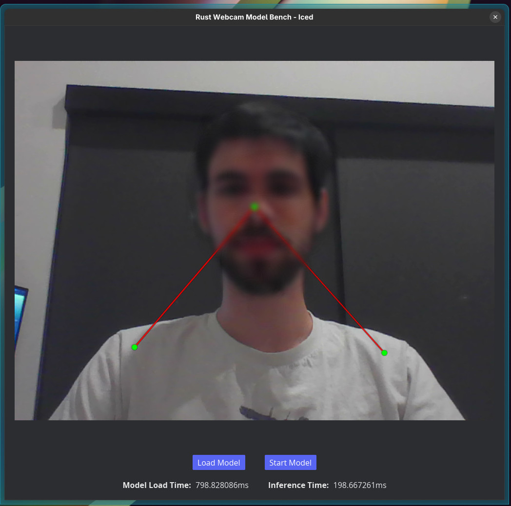

# Rust Webcam Model Bench
### Test ONNX computer vision models easily

**Currently only works on Linux, since the webcam library is based on v4l2**



### Overview

**MVP**: Run an ONNX computer vision model using Rust with Iced, Ort, and a webcam library.

**Post-MVP Goals**:
- Support more configurations for inference outputs (bounding boxes, pose tracking, etc.)
- Add testing suite
- Add a copy to clipboard button for inference times
- Add line graph to view inference time over time
- include stats/warning about low confidence points trimmed
- Support more model types (tensor-lite, coreML, etc.)

### Pipeline
```
Camera ---> CV ----> UI
    |                ^
    |________________|
```
**Camera's role**: 
1. Captures the frame from the webcam
2. Converts it from YUYV to RGBA
3. Places a copy in the shared reference for CV
4. Sends a reference to a buffer in a pool directly to UI using `tokio` broadcast channel

**CV's role**:
1. Pull frame from shared reference
2. Perform inference on frame
3. Draw inference on a blank background
4. Sends a reference to a buffer in a pool to UI using `tokio` broadcast channel

**UI's role**:
1. Subscirbe to both broadcast channels
2. Update upon receiving a message
3. Display camera frame with inference overlayed in front

### Test Models
- Pose [link](https://huggingface.co/onnx-community/vitpose-base-simple)